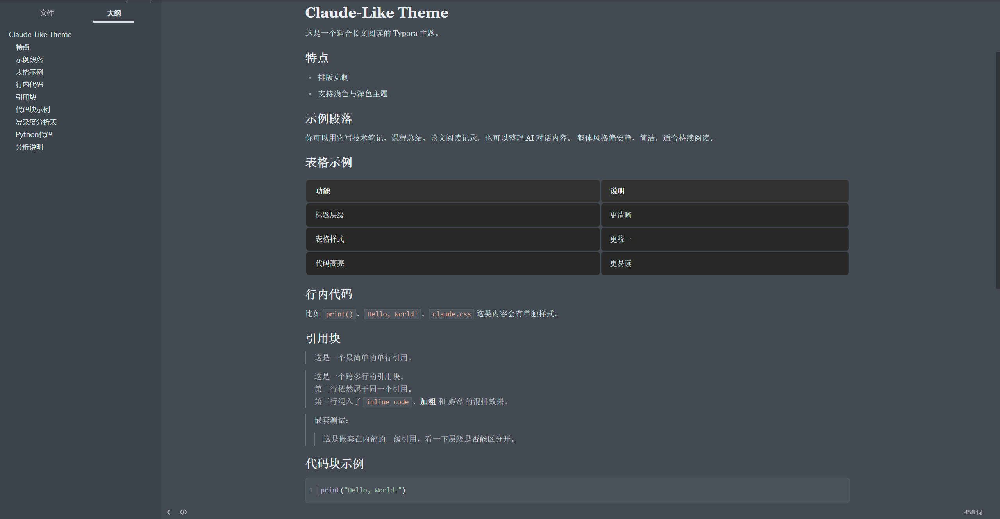
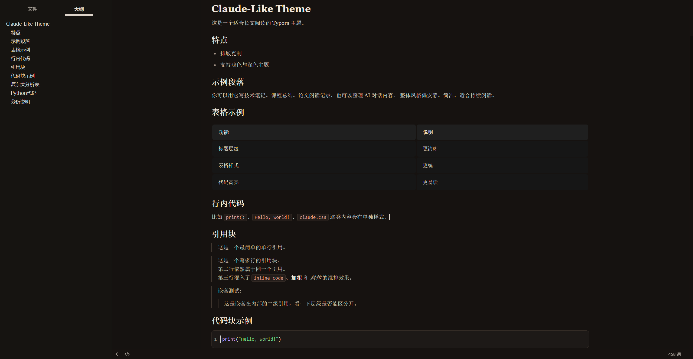

# Claude-Like Theme

> [English Version Below](#english-version)






一个以 Claude-like 阅读体验为灵感、并针对中文写作重新打磨的 Typora 主题。现提供浅色、Morandi 灰蓝、深色三个版本。

## 文件说明

- `claude-like.css`：浅色主题
- `claude-like-grey.css`：Morandi 灰蓝主题
- `claude-like-dark.css`：深色主题

以上三个 CSS 文件由 `scss/` 目录下的 SCSS 源文件编译生成。每个变体只维护自己的 `:root` 调色板，所有结构样式集中在 `scss/_base.scss`。

## 开发与构建

```bash
npm install         # 安装 sass
npm run build       # 编译一次，输出三个 CSS 文件
npm run watch       # 监听源文件变化，自动编译
```

修改主题时只需要编辑 `scss/` 下的源文件，提交前运行 `npm run build` 重新生成根目录的 CSS。

## HTML 增强（可选）

主题除了在 Typora 编辑器内的样式之外，还提供一份**浏览器端**的 HTML 增强插件。它给导出的 HTML 加上浮动目录、代码复制按钮、图片放大、脚注 hover 浮窗、light/grey/dark 主题切换器等阅读体验，无需依赖 Typora 本身。

### 安装

1. 从 [Releases](../../releases) 下载最新的 `claude-like-plugin.html`（或自己 build，见下）。
2. 在 Typora：偏好设置 ▸ 导出 ▸ 新建一个 HTML 配置（例如命名为 "Claude HTML"）。
3. 在该配置的「在 `<head/>` 中添加」字段里，粘贴整个 `claude-like-plugin.html` 文件的内容。
4. 之后从此配置导出文档时，生成的 HTML 自动带增强。

### 自己构建

```bash
npm install
npm run build       # 同时产出三个 CSS + dist/claude-like-plugin.html
```

详细设计与实现计划见 [`docs/specs/2026-05-19-html-enhancement-design.md`](docs/specs/2026-05-19-html-enhancement-design.md) 与 [`docs/plans/2026-05-19-html-enhancement-implementation.md`](docs/plans/2026-05-19-html-enhancement-implementation.md)。

## 协议

本项目基于 MIT 协议开源，详见根目录 [LICENSE](LICENSE) 文件。

---

`<a id="english-version"></a>`

# Claude-like Theme

A Typora theme inspired by a Claude-like reading experience, refined for Chinese writing and technical Markdown workflows. It ships in three variants: light, a Morandi gray-blue grey, and dark.

## Installation

You can also download the latest theme files directly from the GitHub Releases page.

1. Open Typora.
2. Go to `Preferences -> Appearance -> Open Theme Folder`.
3. Copy the following files into the theme folder:

   - `claude-like.css`
   - `claude-like-grey.css`
   - `claude-like-dark.css`
4. Restart Typora.
5. Choose one of the following from the Theme menu:

   - `Claude-like`
   - `Claude-like Grey`
   - `Claude-like Dark`

> **Recommended setting (Windows)**: Go to `Preferences -> Appearance` and set **Window Style** to **Unibody** (restart Typora to apply). The theme is optimized for Unibody mode on Windows.

It is not a direct clone of a webpage. Instead, it keeps the calm, restrained, long-form reading atmosphere associated with a Claude-like style, while reworking typography, tables, code blocks, and export behavior for practical Markdown use.


## Files

- `claude-like.css`: light theme
- `claude-like-grey.css`: Morandi gray-blue theme
- `claude-like-dark.css`: dark theme

The three CSS files are compiled from SCSS sources under `scss/`. Each variant only maintains its own `:root` palette; all structural styles live in `scss/_base.scss`.

## Development

```bash
npm install         # install sass
npm run build       # compile once
npm run watch       # rebuild on change
```

When editing the theme, modify the files in `scss/` and run `npm run build` to regenerate the top-level CSS files before committing.

## HTML Enhancement (optional)

In addition to the in-editor styling, the theme ships a **browser-side** HTML enhancement plugin. It adds a floating table of contents, code-copy buttons, image lightbox, footnote popovers, and a light/grey/dark theme switcher to exported HTML — all without Typora at runtime.

### Install

1. Download the latest `claude-like-plugin.html` from [Releases](../../releases) (or build it yourself, see below).
2. In Typora: Preferences ▸ Export ▸ create a new HTML profile (e.g. named "Claude HTML").
3. Paste the entire content of `claude-like-plugin.html` into the profile's "Append in `<head/>`" field.
4. Documents exported from this profile will then carry the enhancement.

### Build it yourself

```bash
npm install
npm run build       # produces the three CSS files + dist/claude-like-plugin.html
```

Design and implementation plan: [`docs/specs/2026-05-19-html-enhancement-design.md`](docs/specs/2026-05-19-html-enhancement-design.md) and [`docs/plans/2026-05-19-html-enhancement-implementation.md`](docs/plans/2026-05-19-html-enhancement-implementation.md).

## License

This project is licensed under the MIT License. See [LICENSE](LICENSE) for details.

## Acknowledgments / 鸣谢

- Derived from [Muyiiiii/Typora_Claude-Like_Theme](https://github.com/Muyiiiii/Typora_Claude-Like_Theme) (MIT). 派生自该仓库。
- HTML enhancement design and implementation reference [MadMaxChow/VLOOK](https://github.com/MadMaxChow/VLOOK) (MIT). HTML 增强部分的设计与实现参考了该项目。