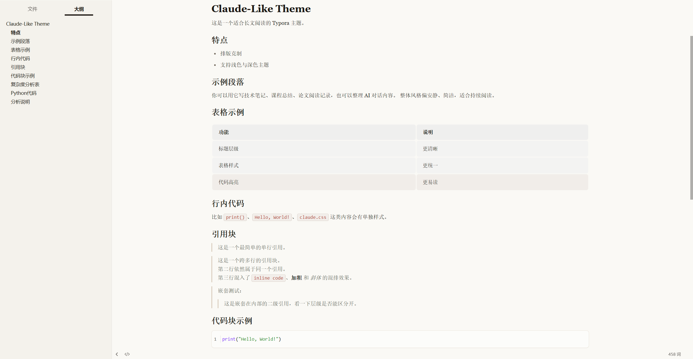

# 一级标题：测试文档总览

本文档用于综合验证 HTML 增强功能。每次发版前请用三个主题各导出一份 HTML。

## 二级标题：基础排版

正文段落。这是一段用来验证字号、行距、字体的中文文本，*斜体*、**加粗**、`inline code`、混合 English text 都应在视觉上和谐。

> 单行引用：左侧应有 3px 强调色竖线，无背景填充，无圆角。

> 多行引用：
> 第二行。
> 第三行混入 `inline code`、**加粗**。

### 三级标题：列表

- 无序项一
- 无序项二
  - 嵌套
- 无序项三

1. 有序项一
2. 有序项二
3. 有序项三

#### 四级标题(默认折叠在三级标题下,点 chevron 展开后可见)

正文……

##### 五级标题

###### 六级标题

## 二级标题：表格

| 列 A | 列 B | 列 C |
| ---- | ---- | ---- |
| 单元 1 | 单元 2 | 单元 3 |
| 长一些的内容,看 padding 是否撑开 | 中等 | 短 |

## 二级标题：代码块

Python：

```python
def fibonacci(n):
    if n < 2:
        return n
    return fibonacci(n - 1) + fibonacci(n - 2)

for i in range(10):
    print(fibonacci(i))
```

JavaScript：

```javascript
const x = 1;
const y = 2;
console.log(x + y);
```

Bash：

```bash
echo "hello"
ls -la
```

## 二级标题：图片



## 二级标题：脚注

正文里有一个脚注[^1]，再来一个[^second]，验证 hover 弹窗工作。

[^1]: 这是第一个脚注的内容。可以包含 `inline code` 和 **加粗**。
[^second]: 这是第二个脚注，看不同 id 是否正确取到。

## 二级标题：数学（如主题支持）

行内公式 $E = mc^2$ 应渲染。

块级：

$$
\sum_{i=1}^{n} i = \frac{n(n+1)}{2}
$$
